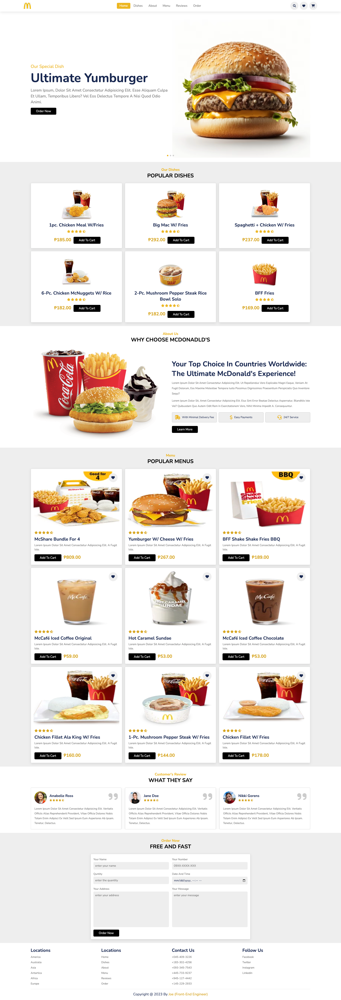
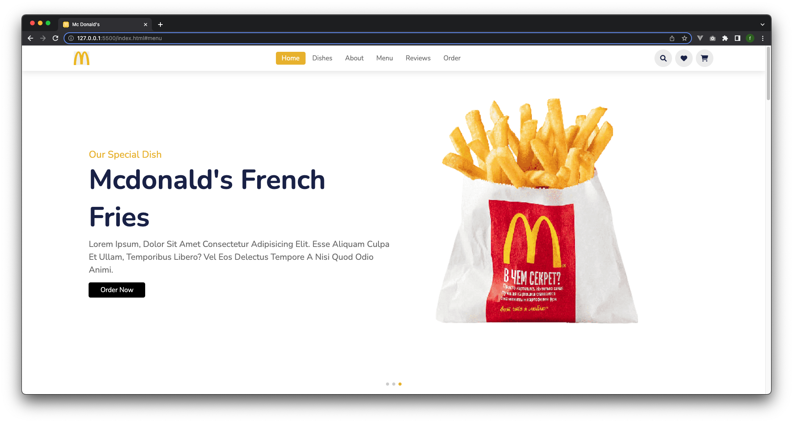
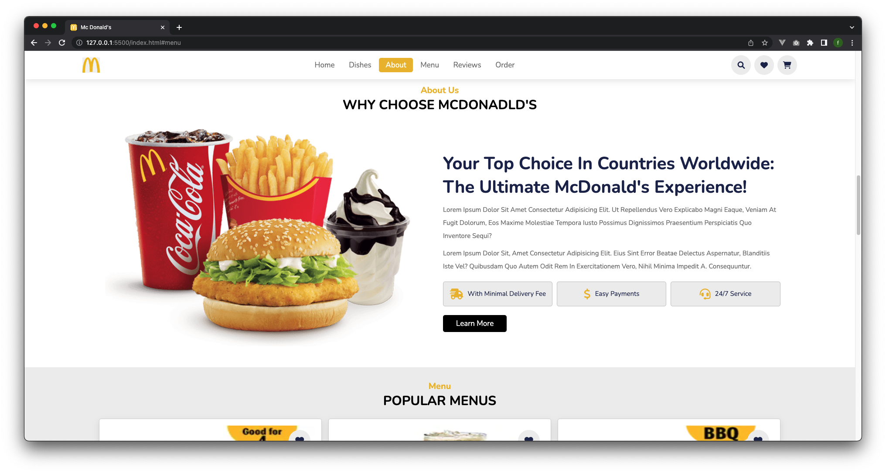
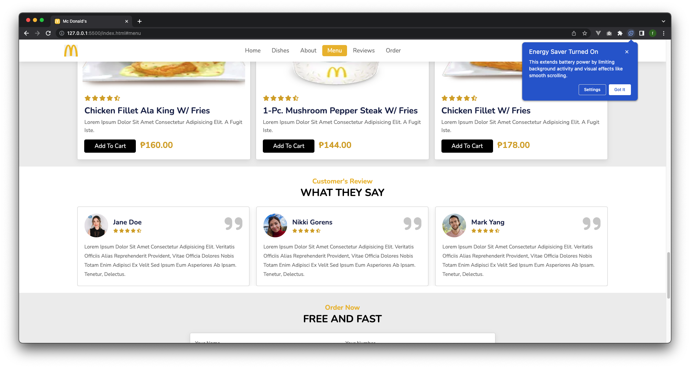

# Mcdonalds UI Redesign

Welcome to the Mcdonalds UI Redesign repository! This project aims to redesign the user interface of the Mcdonalds website to provide a modern and visually appealing experience for users. The redesign will focus on improving usability, responsiveness, and overall user satisfaction.

## Features

- Modern and intuitive user interface
- Improved navigation and menu browsing experience
- Responsive design for seamless usage across different devices
- Optimized performance for faster page load times
- With carousel and swiper js animation

## Screenshots

## Technologies Used

- HTML5
- CSS3
- JavaScript ES6
- Swiper JS

## Getting Started

To get a local copy up and running, follow these steps:

1. Clone the repository: `git clone https://github.com/alonzojoe/Mcdonalds-UI-Redesign.git`
2. Navigate to the project directory: `cd Mcdonalds-UI-Redesign`
3. Open `index.html` in your preferred browser.

## Contributing

Contributions are welcome! If you'd like to contribute to the Mcdonalds UI Redesign project, please follow these steps:

1. Fork the repository
2. Create your feature branch: `git checkout -b feature/NewFeature`
3. Commit your changes: `git commit -am 'Add some feature'`
4. Push to the branch: `git push origin feature/NewFeature`
5. Open a pull request

## Contact

For any questions or inquiries, please contact [Your Name](medusazxc123@gmail.com).

